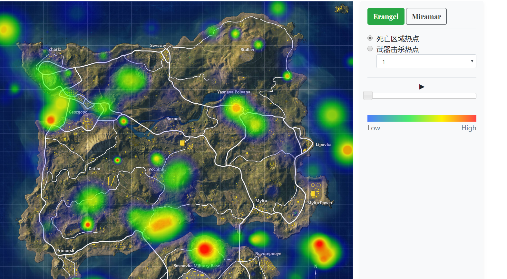

# PUBG_数据分析

项目数据源来自于Kaggle上的公开数据，戳这里：[https://www.kaggle.com/skihikingkevin/pubg-match-deaths](https://www.kaggle.com/skihikingkevin/pubg-match-deaths)

据发布者所说，数据是以自己的账户作为种子爬取的，所以数据并不完全。

此项目仅作为大数据分析学习之用。

## 可视化效果

## 环境

* Hadoop 2.7.6
* Spark 2.1.0
* Hive 1.2.1
* Zookeeper 3.4.6
* Scala 2.11.8

